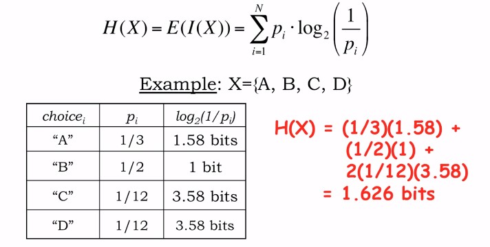
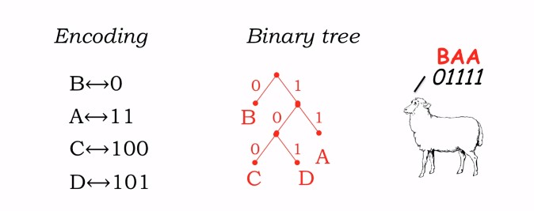
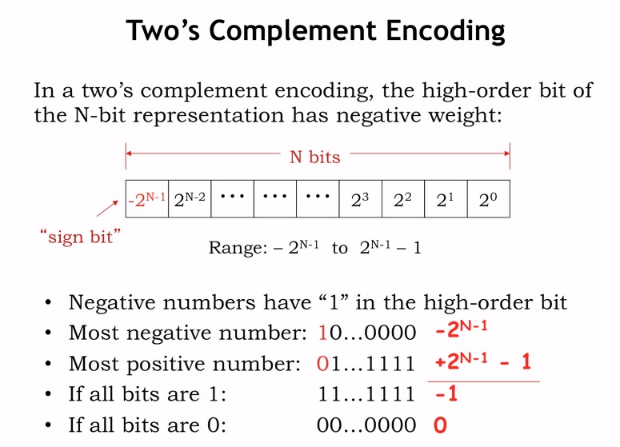

## What is Information

정보란 무엇인가?

>정보란 특정한 사실이나 환경에 대한 불확실성을 해소하는 데이터의 전달이다.

데이터가 해소하는 불확실성이 클수록, 더 많은 정보가 데이터로 전달된다고 할 수 있다.

예를 들어, 52개로 이루어진 카드 덱에서 카드 한 장을 선택한다고 보자.
다음과 같은 데이터를 전달받았다고 가정해보자.

1. 하트 문양 ( 13 / 52 )
2. 스페이드 에이스가 아님 ( 51 / 52 )
3. 인물이 그려져있음 ( 12 / 52 )
4. 자살하는 왕이 그려져있음(하트 킹) ( 1 / 52 )

가장 많은 정보를 전달하는 데이터는 무엇인가?

다른 말로, 어떤 데이터가 선택된 카드에 대해 가장 많은 불확정성을 해소하는가?

비슷하게, 가장 적은 정보를 전달하는 데이터는 무엇인가?

----

## Quantifying Information

* N개의 가능한 값 : $X_1$, $X_2$, $...$ , $X_n$
* 그에 대한 확률 : $P_1$, $P_2$, $...$ , $P_n$

$I(x_i)$ = $log_2$($1 \over p_i$)

e.g., $I(Heart)$ = $log_2$($1 \over 13/52$) = 2 bits

예를 들어, 52장의 카드 중 하트인 카드를 뽑았다는 데이터는 2비트의 정보로 양자화할 수 있다.

1. 하트 문양 ( 13 / 52 ) = 2 bits
2. 스페이드 에이스가 아님 ( 51 / 52 ) = 0.028 bits
3. 인물이 그려져있음 ( 12 / 52 ) = 2.115 bits
4. 자살하는 왕이 그려져있음(하트 킹) ( 1 / 52 ) = 5.7 bits

----

## Entropy

어떤 변수의 엔트로피란, 어떤 정보의 값에 대해 알았을 때 얻은 정보의 평균이다.

그래서, 엔트로피가 우리에게 무엇을 말해주는가?

엔트로피는 정보 전달을 위한 비트의 Lower Bound이다.

어떤 정보를 보내기 위해 몇개의 비트로 그 정보를 인코딩한다고 가정하자.

만약 엔트로피 H(x)보다 적은 비트를 보내면, 불확실성을 완전히 해소하는 제대로 된 정보를 전달할 수 없다.

반면, 엔트로피보다 더 높은 비트로 정보를 전달하면, 그건 괜찮다. 다만 비효율적일 뿐이다.

정확히 엔트로피와 일치하는 비트로 정보를 보낼 수 있다면, 그것은 완벽하게 인코딩한 것이다.

----

## Encoding

인코딩이란 비트 문자와 인코딩할 데이터 집합 간의 모호하지 않은 사상(Mapping)이다 .

A, B, C, D을 00, 01, 10, 11로 인코딩한다고 가정하자.
ABBA는 00 01 01 00으로 나타낼 수 있다.

또한, 각 기호에 대해 서로 다른 길이의 비트를 사용할 수도 있다.
이런 가변 길이 인코딩은 기호가 서로 다른 확률로 등장할 때 효과적이다. 

이런 경우 인코딩이 모호하지 않게 주의해야 한다. 어떤 문장을 가변길이로 인코딩했는데, 디코딩할 때 모호함이 생길 수 있다.

예를 들어 ABBA를 인코딩했는데, ABBA인지 ADA인지 구분할 수 없는 경우처럼 말이다.

이진 트리로 인코딩하는 경우, 리프만 기호를 사용할 경우 유효한 가변 길이 인코딩을 얻을 수 있다.

----
## Fixed-Length Encodings

만약 인코딩하려는 모든 기호가 같은 확률을 가진다면, 우리는 고정길이 인코딩을 사용할 수 있을 것이다.

고정길이 인코딩을 이진 트리로 나타낼 때, 모든 리프는 루트에서 같은 거리를 지닌다.

고정 길이 인코딩은 임의 접근이 가능하다.
예를 들어 인코딩된 메시지의 세 번째 기호가 필요하다고 했을 때, 그냥 정해진 비트를 건너뛰고 읽으면 된다.

모든 기호가 같은 확률을 가질 경우 엔트로피는 그냥 log2(n)이다.

흔한 인코딩의 예는 ASCII인데, 영어 문자를 컴퓨터로 나타낼 때 쓰인다.
ASCII는 94개의 문자를 가진다. ASCII의 엔트로피는 log2(94), 6.555비트이다.
그러므로 각 기호를 인코딩하는 데에 7비트가 필요하다.

또 다른 예는 10진수를 2진수로 변환할 때이다. 10진수 n에 대해 log2(n)개 만큼의 비트가 필요하다.

많은 디지털 시스템이 바이너리 인코딩 시스템을 지원하도록 설계된다. 32비트나 64비트처럼 말이다.

2진수를 나타내기엔 숫자가 너무 커지므로, 4진수의 꼴로 많이들 표현한다.

0111 1101 0000을 7D0으로 나타내는 식이다.
4진수인 것을 표현하기 위해 0x7D0 형태로 표현한다.

많은 프로프래밍 언어가 바이너리 비트 문자열을 표현하기 위해 이러한 표기를 컨벤션으로 사용하고 있다.

----

## 2's Complement

부호가 있는 정수를 표현하기 위한 마지막 도전은, 예를 들어 -200을 어떻게 표현할 것인가?

10진 표기법에서는 +, -같은 기호를 통해 양수와 음수를 나타냈다. 보통 양수는 +를 생략한다.

비슷한 표기를 채택할 수 있다. signed magnitude라 부르는, 가장 앞의 이진 문자를 부호를 나타내는 데에 쓴다.

0은 양수를, 1은 음수를 나타낸다.

그러나 이렇게 하면 0을 표현하는 방식이 두 가지가 될 수 있다.
1로 시작하는 -0, 0으로 시작하는 +0

이는 인코딩을 비효율적으로 만들고, 더 중요하게는 더하기를 위한 회로와 빼기를 위한 회로가 달라진다.

물론, 우리는 하나의 기법을 통해 더하기와 빼기를 한다.

회로를 단순하게 가져가기 위해, 대부분의 현대 디지털 시스템은 2의 보수 체계를 통해 부호가 있는 숫자를 표현한다.

이 표현법에서, 높은 자리 비트(high-order bit)는 음의 가중치를 가진다.

그러므로 모든 음수는 앞 자리 비트로 1을 가진다. 그런 의미에서 앞 자리 비트는 부호 비트(sign bit)로 쓰인다.

가장 작은 N 자리 숫자는 앞 자리에 1을 가지고, -2^(n-1)을 나타낸다.

가장 큰 N 자리 숫자는 음의 가중치인 high-order bit에 0을 가지고, 양의 가중치를 가진 나머지 모든 비트는 1이다.

예를 들어 1000은 -8이며, 0111은 7이다.
가장 앞자리 1을 음의 가중치로 2^(n-1)의 값으로 따지고, 그 뒤 비트를 양의 가중치를 가진 값으로써 더하면 음수를 나타낼 수 있다.

가장 작은 숫자는 -2^(n-1)에 0을 더한 것이므로 -2^(n-1)이다.
반대로 가장 큰 숫자는 0에 나머지 모든 비트를 더한 것이므로 2^(n-1)-1이 된다.

두 숫자를 더할 때는 그냥 더하면 된다.

11...1111이 -1이므로 
11...1111 + 00...0000 = 11...1111 = -1이다.

00..0001을 더해야만 둘을 더했을 때 0이 된다.

그러면 저 1은 자리를 계속 올리다가 사라져버리고 0을 00...0000으로 표현할 수 있다.

만약 양수를 빼고 싶을 때는 어떻게 하는가?

A + (-A) = 0 = 1 + -1

-A = (-1 - A) + 1

(-1 - A) : -1은 11...1111이므로, 각 자릿수에 A의 각 자릿수를 빼주면 된다. 즉, 각 자릿수에 대해 보수를 취하면 된다(Bitwise complement). 1이면 0으로, 0이면 1로.

그리고 +1을 해주면 -A가 나온다.

그러므로 **-A = ~A + 1**로 표현할 수 있다.

짜잔.

당신이 기억해야 하는 것은 이진 덧셈과 2의 보수로 음수 만들기(비트를 뒤집고 +1)가 전부다.

----

## Variable-length Encoding

고정 길이 인코딩은 잘 동작한다. 모든 가능한 선택들이 같은 정보를 가지고 있을 때.
예를 들어 모든 선택이 같은 발생확률을 가질 때처럼.

만약 그런 선택들이 같은 정보를 지니지 않는다면, 우리는 더 잘 할 수도 있다.

어떻게 하는지 보기 위해, 인코딩의 예상길이를 고려해보자.

여기서 더 잘한다는건, 고정 길이 인코딩에 비해 더 짧은 인코딩을 찾는다는 것을 의미한다.

이상적으로, 인코딩의 기대 길이는 엔트로피 H(X), 즉 기대 정보만큼이다.

그러나 실제로는 어떻게 하냐면,

만약 x_i가 더 높은 확률을 가지고 있을 때, 짧은 인코딩을 쓴다.
반대로 더 낮은 확률을 가지고 있을 때, 긴 인코딩을 쓴다.

이런 인코딩을 가변길이 인코딩이라 한다.

높은 확률의 선택은 적은 정보를 전달하므로, 짧은 인코딩을 쓴다. 반면 낮은 확률의 인코딩은 더 많은 정보를 전달하므로 긴 인코딩을 쓴다.

이 인코딩을 이진 트리로 나타내보자. 모든 기호가 트리의 리프에 나타난다. 우리는 그 인코딩이 모호하지 않다는 것을 알 수 있다.

트리의 왼쪽으로 가면 0, 오른 쪽으로 가면 1, 리프에 닿으면 멈춘다.

...

일반적으로, 가장 최적의 가변길이 코드를 얻는 시스템적인 방법이 있다. 다음 장에 알아보자.

----

## Huffman's Algorithm

허프만 알고리즘은 최적 가변길이 인코딩 방법이다.

여기서 말하는 최적이란 한 번에 하나씩 기호를 인코딩 했을 때, 다른 어떤 가변길이 부호(Code)가 더 짧은 기대 길이를 가질 수 없다는 뜻이다.

이 알고리즘은 이진 트리를 아래에서부터 만든다.

가장 적은 확률의 두 기호에서 시작한다. (가장 많은 정보, 가장 긴 인코딩)
만약 어디서든 기호 두 개가 같은 확률을 지닌다면, 그냥 단순히 아무거나 고른다.

기호를 이진 트리로 조합하는데, 하나의 브랜치에는 0, 다른 하나는 1로 라벨을 붙인다.

이진트리에 구성된 두 기호를 제외하고, 그 두 개의 확률을 합친 하나의 서브트리로 대체한다.

이제 계속, 매 단계마다 기호 혹은 서브트리 중에서 가장 적은 확률을 가진 것을 선택해 합쳐서 새로운 서브트리를 만든다.

마지막 단계에서, 우리에겐 두 선택만 남는다. 마지막 기호와 서브트리다. 이를 트리 루트에 붙이면 최적 가변 길이 부호를 나타낼 수 있다.

위에서 언급했듯이, 우리는 각 서브트리 브랜치마다 0, 1로 치환해서 부호를 얻을 수 있다.

## Huffman Code

최적? 꽤 좋아보인다. 정말로 이거보다 더 잘할 수는 없는걸까? 한번에 하나씩 하면 그렇다.

만약 일련의 긴 기호들을 인코딩한다면, 코드가 단일 기호를 나타내는 게 아니라, 여러 기호의 연속을 나타내면 더 짧은 길이의 인코딩을 얻을 수 있다.

현대의 파일 압축 알고리즘은 많은 반복되는 시퀀스를 갖고있다. 자연어나 등등, 단어가 통쨰로 반복되는 경우도 흔하다.

이런 경우에 극적으로 파일 사이즈를 줄일 수도 있을 것이다.

만약 여기 관심이 있다면, "LZW" 압축 알고리즘을 위키피디아에서 살펴보라.
