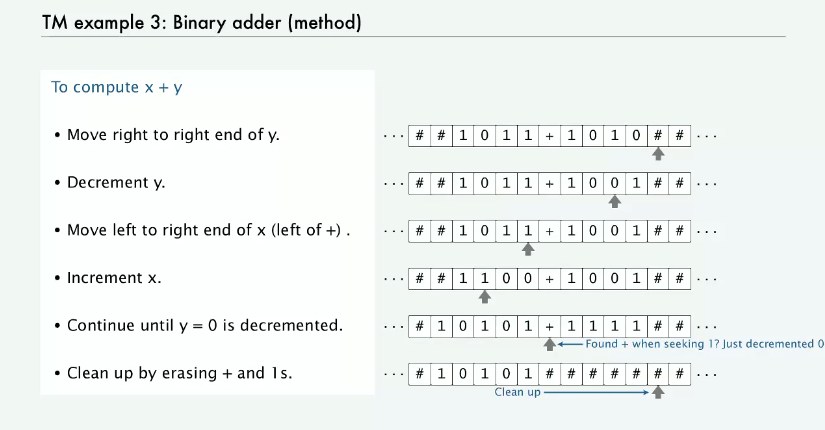

## 맥락

이론적 컴퓨팅 과학의 심장이라 할 수 있는 주제에 대해 얘기해보자.

컴퓨터에 대한 형식적 기저는 1930년대에 튜링에 의해 개발되었다.

맥락을 좀 알아보면

컴퓨테이션을 이해하는 데에 핵심적인 질문인 보편성(Universality)과 계산가능성(Computability))에 대해 얘기해보자.

근본적인 질문

* 뭐가 일반 목적 컴퓨터지?
* 디지털 컴퓨터로 할 수 있는 일에 한계가 있는가?
* 우리가 만들 수 있는 머신 파워에 한계가 있는가?

* Complete
  * 형식 체계가 만들 수 있는 모든 선언의 진위 여부를 가릴 수 있는가
* Consistent
  * 모순을 가지는가
* Decidable
  * 모든 선언의 진위 여부를 가릴 수 있는 알고리즘이 존재하는가

수학은 위 조건 모두 아니다.

## 컴퓨테이션 단순 모델

목표는 모든 알려진 계산 과정을 처리할 수 있는 계산 모델의 개발이며, 가능한 한 단순하게 만드는 것이다.

예를 들어 더하기의 특성은 이산적이고, 지역적이며, 스테이트를 가진다.

튜링 머신은 컴퓨테이션의 추상 모델이다.

인풋 테이프를 읽으면서 왼쪽으로도, 오른쪽으로도 이동할 수 있으며 인풋 테이프의 기호를 읽고 거기에 다른 기호를 입력할 수도 있다. 왼쪽, 오른쪽, 정지 스테이트가 있다. 각 전이는 인풋:아웃풋의 쌍으로 이루어진다.

유한 오토마타와의 비교

비슷한 점

* 계산의 단순 모델
* 유한 길이의 기호 테이프를 입력으로 받음
* 유한한 숫자의 스테이트
* 스테이트 전이는 현재 스테이트와 입력 기호에 따라 결정됨

다른 점

* 유한 오토마타는 입력을 읽을 수만 있지만, 튜링머신은 인풋을 읽고 거기에 쓸 수도 있다.
* 유한 오토마타는 오른쪽으로만 이동 가능, 튜링머신은 양쪽으로 이동 가능
* 유한 오토마타는 유한하지만, 튜링머신은 양쪽으로 이동할 수 있으므로 끝나지 않음
* 유한 오토마타는 기호 하나 당 하나의 스텝이지만, 튜링머신은 기호 당 스텝의 제한이 없음
* 유한 오토마타는 예/아니오를 인식 가능하지만, 튜링 머신은 그에 더해 계산도 가능(인풋 테이프에 기록)

튜링 머신은 무한히 이동할 수 있기 때문에 버그가 있을 수도 있다.

트랜지션과 스테이트를 제대로 고안하지 않으면 끝없이 움직이며 정지 스테이트로 가지 않을수도.

## 보편성

