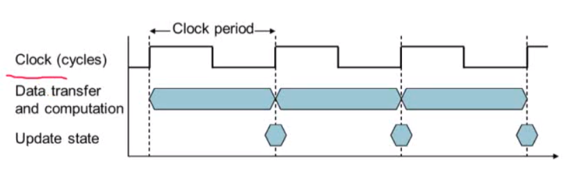

<h2>2차시 <a href="http://www.kocw.net/home/cview.do?lid=83030621fe62e08e">링크</a></h2>

<h3>챕터 학습목표</h3>
> 퍼포먼스의 정의를 이해할 수 있다.

#

<h3>1-4. Under the Covers</h3>
<h4>1.Components of a Computer</h4>

1.  많은 컴퓨터에서 기본적으로 같은 컴포넌트를 가지고 있음.
    1. 데스크탑, 서버, 임베디드.
    
2. Input/Output 디바이스를 가지고 있다.

    1. User-Interface devices
        > 디스플레이,키보드, 마우스
    2. 저장장치
        > 하드디스크, CD/DVD, flash
    3. 네트워크 어댑터
        > 다른 피씨와 통신
        
<h4>2. Inside the processor</h4>

> 세가지 구성요소로 되어있음
1. DataPath
    > 데이터가 어떻게 연산이 되는지
2. Control
    > 프로세서의 다양한 컴포넌트를 컨트롤하는 것
3. Cache Memory
    > 데이터의 접근을 바로 하기 위한 작은 SRAM 메모리 공간  
    작을수록 빠르다. (원칙)
        
    
<h4>3. Abstraction</h4>

1. 복잡한 문제를 단순화함.  
    > 컴퓨터 구조에서 가장 대표적인 예 ) ISA
2.  Instruction set architecture
    > 소프트웨어 하드웨어가 ISA 를 통해 데이터를 주고받는다.
3. Application binary interface
    > ISA + System software architecture
4. implementation
    > ISA를 실제로 어떻게 구현할 것인가.

<h4>4. A Safe Place for Data</h4>

1. Volatile Memory
    > 전원이 나가면 데이터가 사라짐.
2. Non-Volatile Memory
    > Magnetic disk
    > Flash Memory
    > optical memory

<h4>5. Networks </h4>

1. Lan(Local area network)
    > Ethernet
2. Wan (Wide area network)
    > the Internet
3. Wireless network
    > WiFi, BlueTooth
    
#
 
<h3>1-5 Technologies for Building Processors and Memory</h3>
> SKIP 중요하지 않음

#

<h3>1-6 Performance</h3>

<h4>1. ResponseTime and Throughput</h4>

1. ResponseTime
    - 얼마나 작업이 오래 걸리는지
2. Throughput
    - 단위 시간당 할 수 있는 작업의 양
        >task, transactions/... per hours
3. 작업시간에 미치는 요인
    - 더 빠른 CPU
        > Response 타임이 줄어들어 Throughput이 증가함
    - 더 많은 CPU
        > Response 시간은 같지만 Throughput이 증가함.
4. 성능은 Response 타임으로 표현이 가능
    
<h4>2. Relative Performance</h4>

1. Performance
    > $$1 \over Execution Time$$ 으로 정의
2. 성능은 $$P_x \over P_y = E_x \over E_y$$로 상대적 성능을 표현할 수 있다.

<h4>3. Measuring Execution Time</h4>

1. Execution TIme
    > 걸린시간
    1. 토탈 걸린 시간
        > Processing, I/O overhead ,idle time
    2. 시스템의 전체 성능을 결정한다.
    
2. CPU Time
    1. 어떤 일을 처리할 때 CPU 에서 걸린 시간
        > I/O 시간 , 다른 작업을 할때 걸린시간을 제외 > 순수한 CPU 에서 작업에 걸린 시간
    2. User CPU Time, System CPU time
        > User CPU Time : User Level 에서 걸린 CPU 시간  
         System CPU time : 운영체제에서 걸린 CPU 시간.
    3. 각각의 프로그램은 CPU & 운영체제 성능에 의해 달라짐.
        > 어떤 프로그램은 CPU 에 의해 영향을 많이 받을수도 있고  
        IO 에 의해 영향을 많이 받을 수도 있다.
        
<h4>4. CPU Clocking</h4>

      

1. Clock Period
    > duration of a clock cycle
2. Clock Frequency (rate)
    > cycles per second
        
<h4>5. Machine Clock Rate</h4>

> Clock Rate 는 clock cycle time(clock period) 에 반비례 함.  
CC = 1 / CR
